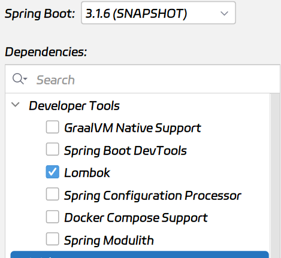

# 后端开发模版
## 创造缘由
开发后端项目的时候，很多时候都要从头开始搭建项目，这样很浪费时间，就把一些常用的东西封装起来，以后开发的时候就可以直接使用了。
## 项目结构
### 依赖库


以及Spring Web

选择的有

1. Lombok
2. Spring Web
3. Mybatis
4. Mysql Driver

还需要配置以下的依赖

1. hutool工具类
2. Sa-Token权限认证
3. pagehelper分页查询

### 配置文件设置

#### properties配置

创建dev开发版和prop运行版配置文件

* application-dev.properties
* application-prop.properties

在application.properties文件中指定所使用的配置文件

```properties
spring.profiles.active=prop
#spring.profiles.active=dev
```

大体配置文件：

```properties
server.port=8080
# 数据库配置
spring.datasource.driver-class-name=com.mysql.cj.jdbc.Driver
spring.datasource.url=jdbc:mysql://192.168.10.104:3306/love_blindbox?useUnicode=true&characterEncoding=utf8&zeroDateTimeBehavior=convertToNull&useSSL=true&serverTimezone=GMT%2B8
spring.datasource.username=root
spring.datasource.password=ar352878987
#下面这些内容是为了让MyBatis映射
#指定Mybatis的Mapper文件
mybatis.mapper-locations=classpath:mapper/*xml
#指定Mybatis的实体目录
mybatis.type-aliases-package=com.maoyan.loveblindbox.entity
# Satoken配置
# token 名称（同时也是 cookie 名称）
sa-token.token-name=LoveBlindBoxToken
# token 有效期（单位：秒） 默认30天，-1 代表永久有效
sa-token.timeout=-1
# token 最低活跃频率（单位：秒），如果 token 超过此时间没有访问系统就会被冻结，默认-1 代表不限制，永不冻结
sa-token.active-timeout=-1
# 是否允许同一账号多地同时登录 （为 true 时允许一起登录, 为 false 时新登录挤掉旧登录）
sa-token.is-concurrent=true
# 在多人登录同一账号时，是否共用一个 token （为 true 时所有登录共用一个 token, 为 false 时每次登录新建一个 token）
sa-token.is-share=true
# token 风格（默认可取值：uuid、simple-uuid、random-32、random-64、random-128、tik）
sa-token.token-style=uuid
# 是否输出操作日志
sa-token.is-log=true
```

#### 配置类

##### 配置CORS

创建config包，在其中创建CorsConfig.java文件

写入：

```java
package com.maoyan.loveblindbox.config;

import org.springframework.context.annotation.Bean;
import org.springframework.context.annotation.Configuration;
import org.springframework.web.servlet.config.annotation.CorsRegistry;
import org.springframework.web.servlet.config.annotation.WebMvcConfigurer;

@Configuration
public class CorsConfig {
    @Bean
    public WebMvcConfigurer corsConfigurer() {
        return new WebMvcConfigurer() {
            @Override
            public void addCorsMappings(CorsRegistry registry) {
                registry.addMapping("/**")
                        .allowedOrigins("*")
                        .allowedMethods("*")
                        .allowedHeaders("*")
                        .maxAge(3600);
            }
        };
    }
}

```

### 全局异常处理

创建exception包，在其中创建handler包和自定义异常类`CustomException`

`CustomException`如下：

```java
package com.maoyan.loveblindbox.exception;

/**
 * 自定义异常
 */
public class CustomException extends RuntimeException {
    private static final long serialVersionUID = 1L;

    private Integer code;

    private String message;

    public CustomException(String message) {
        this.message = message;
    }

    public CustomException(String message, Integer code) {
        this.message = message;
        this.code = code;
    }

    public CustomException(String message, Throwable e) {
        super(message, e);
        this.message = message;
    }

    @Override
    public String getMessage() {
        return message;
    }

    public Integer getCode() {
        return code;
    }
}
```

在handler中创建全局异常处理器

```java
package com.maoyan.loveblindbox.exception.handler;

import cn.dev33.satoken.exception.NotLoginException;
import cn.hutool.core.text.CharSequenceUtil;
import cn.hutool.core.util.StrUtil;
import com.maoyan.loveblindbox.exception.CustomException;
import com.maoyan.loveblindbox.utils.AjaxResult;
import org.springframework.web.bind.annotation.ExceptionHandler;
import org.springframework.web.bind.annotation.RestControllerAdvice;

import java.sql.SQLIntegrityConstraintViolationException;

/**
 * 全局异常处理器
 */
@RestControllerAdvice
public class GlobalExceptionHandler {

    @ExceptionHandler(CustomException.class)
    public AjaxResult businessException(CustomException e) {
        if (StrUtil.isBlankIfStr(e.getCode())) {
            return AjaxResult.error(e.getMessage());
        }
        return AjaxResult.error(e.getCode(), e.getMessage());
    }

    @ExceptionHandler(NotLoginException.class)
    public AjaxResult handlerNotLoginException(NotLoginException nle) {
        // 打印堆栈，以供调试
        //nle.printStackTrace();
        // 判断场景值，定制化异常信息
        String message = "";
        if (nle.getType().equals(NotLoginException.NOT_TOKEN)) {
            message = "未提供Token";
        } else if (nle.getType().equals(NotLoginException.INVALID_TOKEN)) {
            message = "Token无效";
            return AjaxResult.error(NotLoginException.INVALID_TOKEN, message);
        } else if (nle.getType().equals(NotLoginException.TOKEN_TIMEOUT)) {
            message = "Token已过期";
        } else if (nle.getType().equals(NotLoginException.BE_REPLACED)) {
            message = "已被顶下线";
        } else if (nle.getType().equals(NotLoginException.KICK_OUT)) {
            message = "已被踢下线";
        } else {
            message = "当前会话未登录";
        }

        // 返回给前端
        return AjaxResult.error(message);
    }

    @ExceptionHandler(SQLIntegrityConstraintViolationException.class)
    public AjaxResult handlerSQLIntegrityConstraintViolationException(SQLIntegrityConstraintViolationException sqlIntegrityConstraintViolationException) {
        String exceptionMessage = sqlIntegrityConstraintViolationException.getMessage();
        String message = exceptionMessage;
        if (CharSequenceUtil.contains(exceptionMessage, "username")) {
            message = "用户名重复";
        } else if (CharSequenceUtil.contains(exceptionMessage, "email")) {
            message = "邮箱重复";
        }
        return AjaxResult.error(message);
    }
}
```

### 配置工具类

#### HttpStatus类

```java
package com.maoyan.loveblindbox.utils;

public class HttpStatus {
    /**
     * 操作成功
     */
    public static final int SUCCESS = 200;

    /**
     * 对象创建成功
     */
    public static final int CREATED = 201;

    /**
     * 请求已经被接受
     */
    public static final int ACCEPTED = 202;

    /**
     * 操作已经执行成功，但是没有返回数据
     */
    public static final int NO_CONTENT = 204;

    /**
     * 资源已被移除
     */
    public static final int MOVED_PERM = 301;

    /**
     * 重定向
     */
    public static final int SEE_OTHER = 303;

    /**
     * 资源没有被修改
     */
    public static final int NOT_MODIFIED = 304;

    /**
     * 参数列表错误（缺少，格式不匹配）
     */
    public static final int BAD_REQUEST = 400;

    /**
     * 未授权
     */
    public static final int UNAUTHORIZED = 401;

    /**
     * 访问受限，授权过期
     */
    public static final int FORBIDDEN = 403;

    /**
     * 资源，服务未找到
     */
    public static final int NOT_FOUND = 404;

    /**
     * 不允许的http方法
     */
    public static final int BAD_METHOD = 405;

    /**
     * 资源冲突，或者资源被锁
     */
    public static final int CONFLICT = 409;

    /**
     * 不支持的数据，媒体类型
     */
    public static final int UNSUPPORTED_TYPE = 415;

    /**
     * 系统内部错误
     */
    public static final int ERROR = 500;

    /**
     * 接口未实现
     */
    public static final int NOT_IMPLEMENTED = 501;


}

```

#### AjaxResult

```java
package com.maoyan.loveblindbox.utils;

import cn.hutool.core.util.StrUtil;

import java.util.HashMap;

public class AjaxResult extends HashMap<String, Object>
{
    private static final long serialVersionUID = 1L;

    /** 状态码 */
    public static final String CODE_TAG = "code";

    /** 返回内容 */
    public static final String MSG_TAG = "msg";

    /** 数据对象 */
    public static final String DATA_TAG = "data";

    /**
     * 初始化一个新创建的 AjaxResult 对象，使其表示一个空消息。
     */
    public AjaxResult()
    {
    }

    /**
     * 初始化一个新创建的 AjaxResult 对象
     *
     * @param code 状态码
     * @param msg 返回内容
     */
    public AjaxResult(int code, String msg)
    {
        super.put(CODE_TAG, code);
        super.put(MSG_TAG, msg);
    }

    /**
     * 初始化一个新创建的 AjaxResult 对象
     *
     * @param code 状态码
     * @param msg 返回内容
     * @param data 数据对象
     */
    public AjaxResult(int code, String msg, Object data)
    {
        super.put(CODE_TAG, code);
        super.put(MSG_TAG, msg);
        if (!StrUtil.isBlankIfStr(data))
        {
            super.put(DATA_TAG, data);
        }
    }

    /**
     * 返回成功消息
     *
     * @return 成功消息
     */
    public static AjaxResult success()
    {
        return AjaxResult.success("操作成功");
    }

    /**
     * 返回成功数据
     *
     * @return 成功消息
     */
    public static AjaxResult success(Object data)
    {
        return AjaxResult.success("操作成功", data);
    }

    /**
     * 返回成功消息
     *
     * @param msg 返回内容
     * @return 成功消息
     */
    public static AjaxResult success(String msg)
    {
        return AjaxResult.success(msg, null);
    }

    /**
     * 返回成功消息
     *
     * @param msg 返回内容
     * @param data 数据对象
     * @return 成功消息
     */
    public static AjaxResult success(String msg, Object data)
    {
        return new AjaxResult(HttpStatus.SUCCESS, msg, data);
    }

    /**
     * 返回错误消息
     *
     * @return
     */
    public static AjaxResult error()
    {
        return AjaxResult.error("操作失败");
    }

    /**
     * 返回错误消息
     *
     * @param msg 返回内容
     * @return 警告消息
     */
    public static AjaxResult error(String msg)
    {
        return AjaxResult.error(msg, null);
    }

    /**
     * 返回错误消息
     *
     * @param msg 返回内容
     * @param data 数据对象
     * @return 警告消息
     */
    public static AjaxResult error(String msg, Object data)
    {
        return new AjaxResult(HttpStatus.ERROR, msg, data);
    }

    /**
     * 返回错误消息
     *
     * @param code 状态码
     * @param msg 返回内容
     * @return 警告消息
     */
    public static AjaxResult error(int code, String msg)
    {
        return new AjaxResult(code, msg, null);
    }
}
```